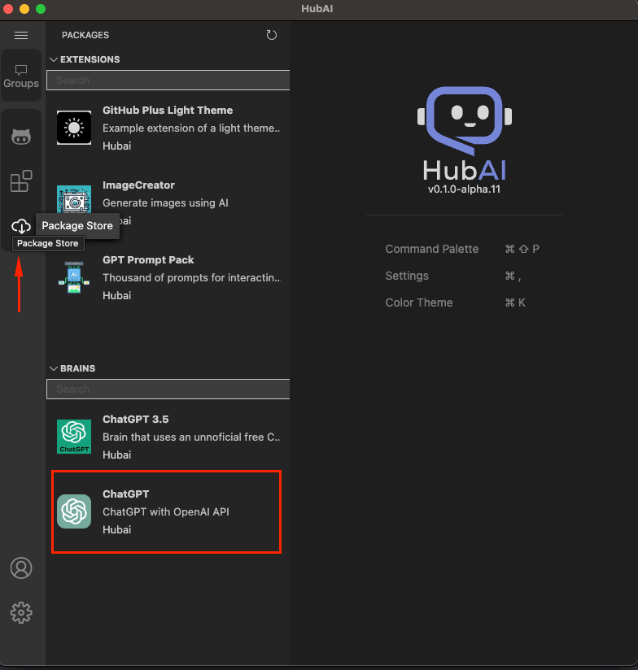
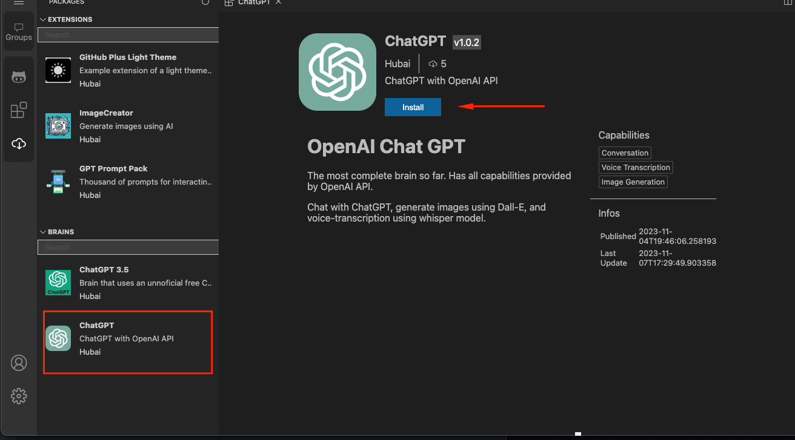
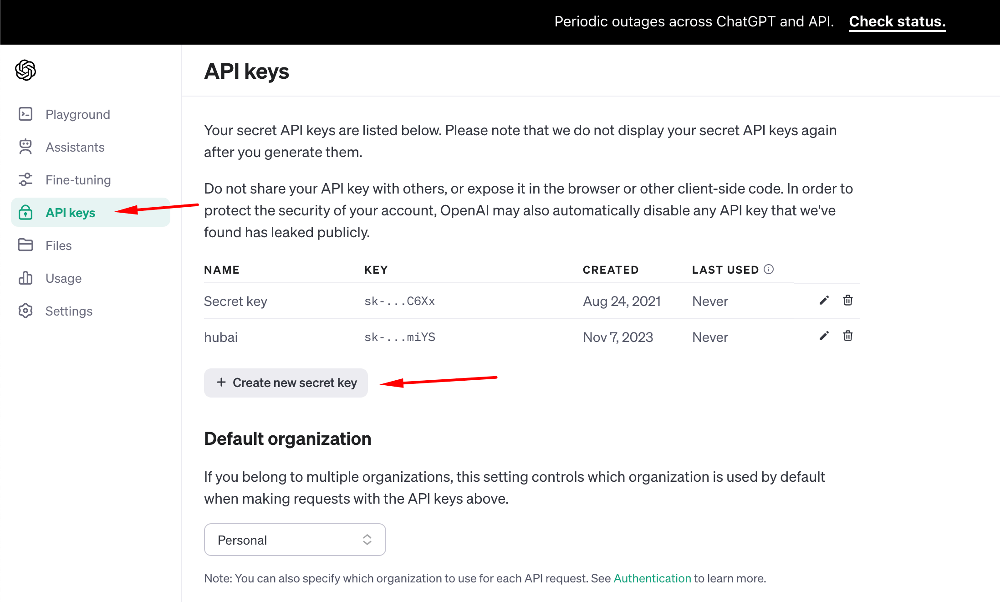
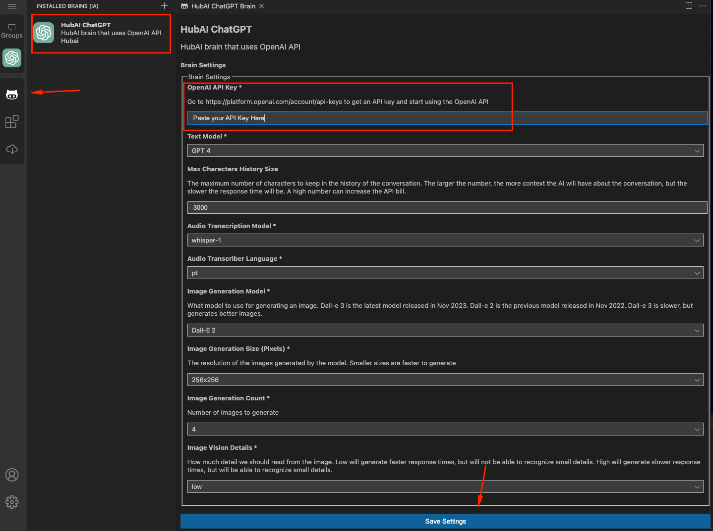

# How to get started with HubAI

If you just installed HubAI, you may be wondering how to start using it. In this guide, we'll show you how to get started with HubAI.

First things first, when you open HubAI for the first time, you won't see any AI or extensions installed. You need to install at least one AI to start using HubAI. To do that, click on "Store" button, select a brain and install it.

We recommend that you start with the ChatGPT one, it has all the capabilities that HubAI supports at the moment and it's very easy to use.

To install the brain, just click on it then click on "Install". After that, restart your app and you're ready to go!

After installing it, it's time to configure. [Log in into your Open AI account](https://platform.openai.com/login?launch) or [create one](https://chat.openai.com/auth/login) if you don't have it. After that, go to the [API Key section of Open AI dashboard](https://platform.openai.com/api-keys) and copy your API key (or generate one if you still don't have).

After that, go back to HubAI and click on the brain settings button. Paste your API key and click on "Save". Then you're ready to go!

:::tip
In order to use all the features that Chat GPT brain has to offer (like gpt-4), we recommend you to buy at least $0.5 cents of credits on Open AI. You can do that [here](https://platform.openai.com/account/billing/overview).
:::
