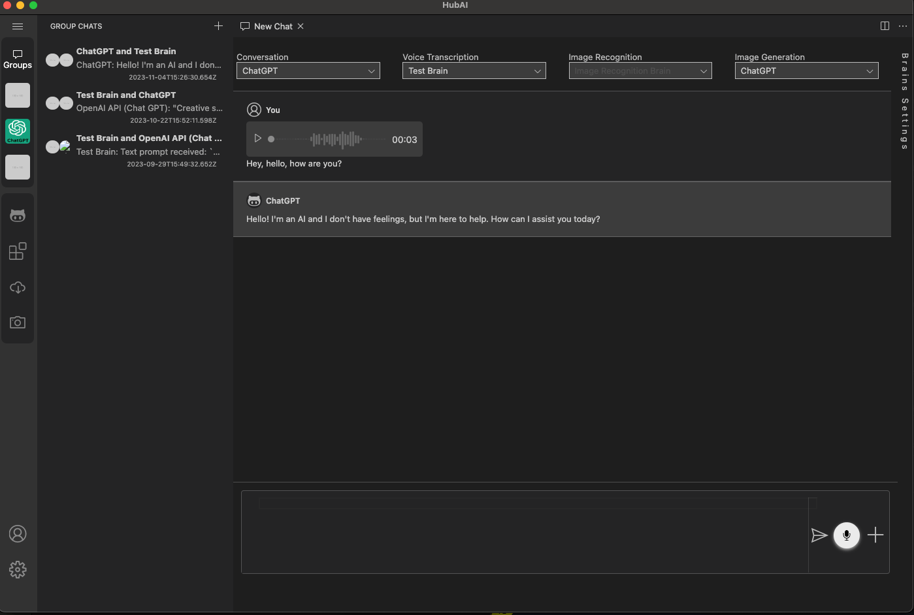
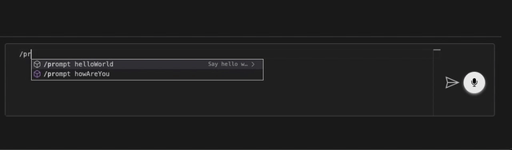
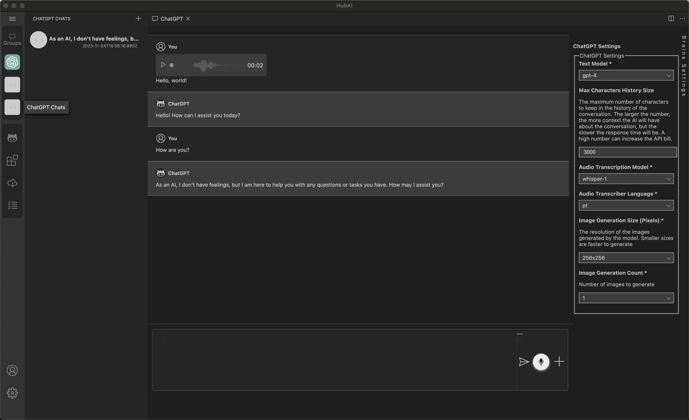
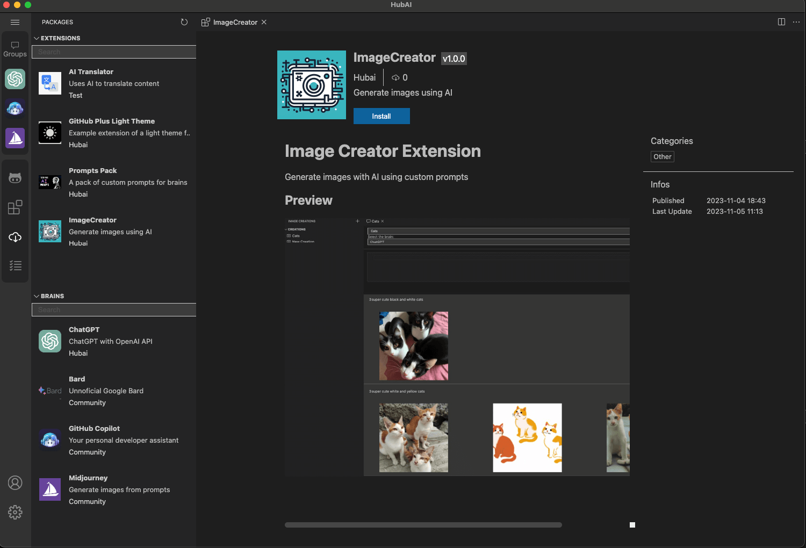

# Transform Your AI Interactions with HubAI: The Ultimate AI Platform

Today we're introducing HubAI to the world. HubAI is a desktop application that will give you a new way to interact with other AIs. HubAI is not just an app; it's your personal gateway to an expansive world of AI functionalities, right from your computer. Experience the thrill of creating, customizing, and engaging with diverse AIs, and join a vibrant community of AI enthusiasts and innovators.

# Key Features

## Multi-Dimensional AI Conversations

### Engage with AIs through Text, Voice, Images and More
HubAI presents a comprehensive chat interface, pioneering in its support for diverse communication modes. Whether it’s text, voice, or image-based interactions, HubAI caters to all your AI communication needs. Enjoy seamless exchanges with AIs, tailored to your preferred style of communication.

### Group Chats: A Confluence of AI Minds

HubAI elevates your AI interaction experience by introducing the novel concept of AI group chats. This feature allows you to simultaneously engage with multiple AIs in a single conversation, creating a dynamic and interactive environment. These AI entities can communicate not only with you but also with each other, leading to a fascinating interplay of artificial intelligence.

For instance, consider our showcased group chat involving two distinct AIs: ChatGPT and TestBrain, in this interactive scenario, I sent a voice message to the group chat. Demonstrating the seamless integration and collaborative functionality of HubAI, TestBrain efficiently handled the voice transcription, while ChatGPT adeptly responded to the transcribed content.

This multifaceted interaction is further enhanced by the user-friendly interface of HubAI, which allows for effortless switching between different AIs within the group chat. Engage in a rich, multi-AI conversation and witness the synergy of different AI personalities and capabilities, all within HubAI's intuitive platform.

### Prompt System 
One of the most exciting features of HubAI is the ability to install custom prompts for your AIs. These prompts are designed to enhance your AI interactions by providing a unique conversational style, topic focus, or interactive functionality.

Dive into the HubAI store, where a diverse array of custom prompts awaits. Here, you can effortlessly browse and select from a wide range of user-created or official prompts, each designed to enhance and tailor your AI conversations. Once installed, these prompts transform your interactions, making each conversation with your AI not just unique but also deeply aligned with your individual needs and interests.

### Single Chat

For more focused interactions, engage in one-on-one chats with your chosen AI. These intimate exchanges are enriched by the AI’s ability to understand and respond to various input forms, like voice messages, ensuring a versatile and responsive communication experience. 

You can also see your full chat history with the selected AI.
 
*Your conversations are yours alone; we ensure complete encrypted local storage without any server-side data retention.*

## Powerful extension system and package store

HubAI has a powerful extension system that allows you to extend the platform in the way that you want. Expand your AI experience by installing new AI brains, prompts, themes, and more from the HubAI store. The possibilities are limitless.

### Community Driven Innovation

Join a community where creativity meets technology. Our open extension store encourages users to design and publish their own extensions and AI brains. With [comprehensive documentation](/docs/intro) and support, stepping into the world of AI development can be a breeze.

Transform your interaction with artificial intelligence today. Dive into the HubAI experience and unleash the full potential of AI at your fingertips.

