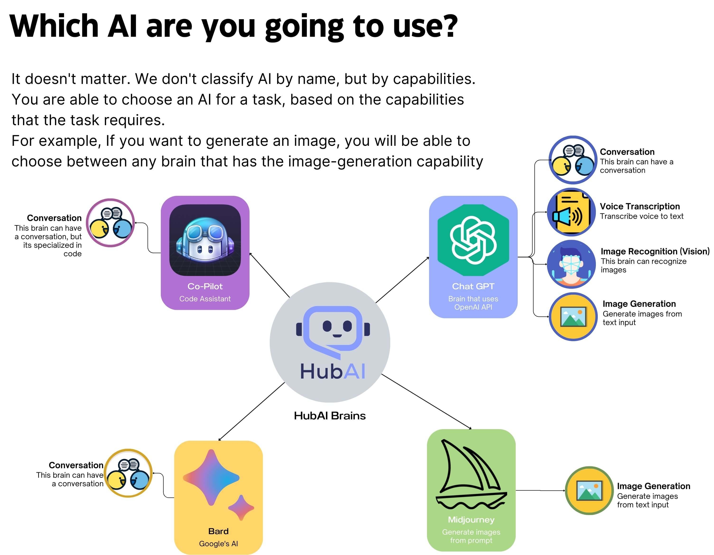
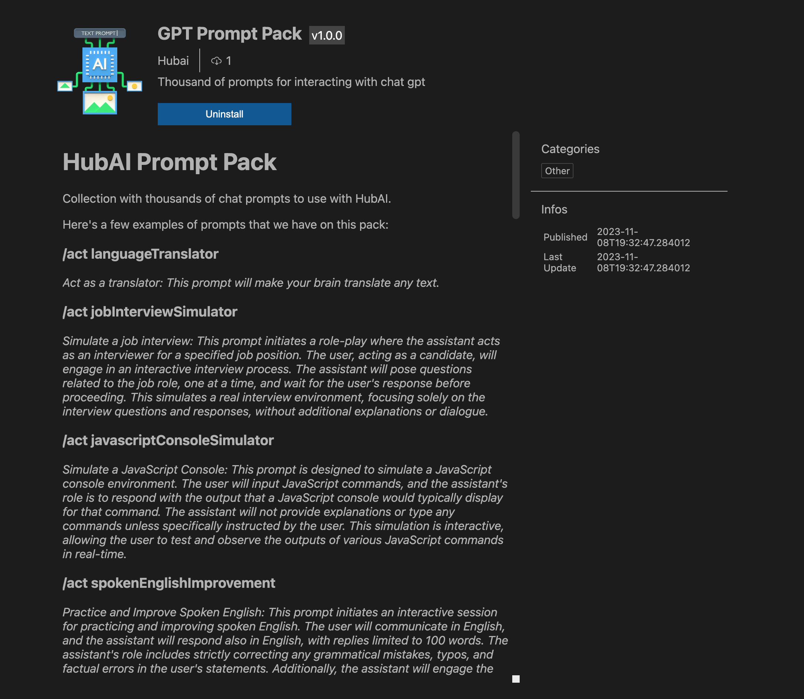

# Transform Your AI Interactions with HubAI: The Ultimate AI Platform

I'm very excited to announce the launch of HubAI, a new platform built for AIs. If your first thought is, "No, another AI platform!" let me assure you, HubAI is something else. 

No one can deny the impact of artificial intelligence on our lives. From the way we communicate to the way we work, AI has transformed our world. However, despite its widespread use, AI remains inaccessible to many. The complex nature of AI tools and the lack of a unified platform for AI interactions have created a barrier to entry for many users. In addition, the lack of a centralized platform has led to a fragmented ecosystem, where users are forced to navigate multiple websites and applications to access the tools they need. This lack of a unified platform has also hindered the development of AI tools, as developers are forced to create their own sites to host their tools (and that's not cheap!). This has led to a proliferation of AI tools, each with its own unique features and limitations. 

I've created HubAI to solve this problem. HubAI allows users to use tools and interact with AI in a unified environment. It provides a centralized platform for AI interactions, allowing users to download and use AI tools from a single location (yes, we have a store for that!). And you know what is better? **HubAI is, and will always be free and open-source**.

For the developers yearning to forge tools that truly make a difference, our platform is your canvas. HubAI provides a centralized platform for developers, allowing them to host their tools on a single platform. Design your innovation without concerning yourself with user AI preferences. Publish your creation in our store, and we'll ensure it reaches the users it's meant to serve. Even more, if you have developed your own AI, you're welcome to integrate it within HubAI (we also have a store for AIs!), widening the horizons for a global community of users.

HubAI was created with scalability and adaptability in mind. Modularity is at the core of the platform, allowing for customization and enhancement through various extensions. Want to tweak the interface, add pioneering AIs, infuse new prompts, or re-imagine almost any aspect of the user experience? HubAI empowers you to do so.

Alright, enough talking, let's see some of the features that HubAI has to offer:

# Key Features

## Multi-Dimensional AI Conversations

### Engage with AIs through Text, Voice, Images and More

HubAI has a complete chat interface that allows you to interact with AIs in a variety of ways. You can send text messages, voice messages, images, and more. HubAI also supports group chats, allowing you to engage with multiple AIs at the same time. (And very soon you'll be able to even add your friends to the group chats with AIs!)

### Group Chats: A Confluence of AI Minds

HubAI elevates your AI interaction experience by introducing the concept of AI group chats. This feature allows you to simultaneously engage with multiple AIs in a single conversation, creating a dynamic and interactive environment. These AI entities can communicate not only with you but also with each other, leading to a fascinating interplay of artificial intelligence.

For instance, consider the group chat in the image below, The chat has two distinct AIs: ChatGPT and TestBrain, in this interactive scenario, I sent a voice message to the group chat. Demonstrating the seamless integration and collaborative functionality, TestBrain efficiently handled the voice transcription, while ChatGPT adeptly responded to the transcribed content (that's two AIs working together baby!).

This multifaceted interaction is further enhanced by the user-friendly interface of HubAI, which allows for effortless switching between different AIs within the group chat. Engage in a rich, multi-AI conversation and witness the synergy of different AI personalities and capabilities, all within HubAI's intuitive platform.

### Prompt System 
One of the most exciting features of HubAI is the ability to install custom prompts for your AIs. These prompts are designed to enhance your AI interactions by providing a unique conversational style, topic focus, or interactive functionality.

Dive into the HubAI store, where a diverse array of custom prompts awaits. Here, you can effortlessly browse and select from a wide range of user-created or official prompts, each designed to enhance and tailor your AI conversations. Once installed, these prompts transform your interactions, making each conversation with your AI not just unique but also deeply aligned with your individual needs and interests.

### Single Chat

For more focused interactions, engage in one-on-one chats with your chosen AI. These intimate exchanges are enriched by the AI’s ability to understand and respond to various input forms, like voice messages, ensuring a versatile and responsive communication experience. 

You can also see your full chat history with the selected AI.
 
*Your conversations are yours alone; we ensure complete encrypted local storage without any server-side data retention.*

## Powerful extension system and package store

HubAI has a powerful extension system that allows you to extend the platform in the way that you want. Expand your AI experience by installing new AI brains, prompts, themes, and more from the HubAI store. The possibilities are limitless.

### Community Driven Innovation

Join a community where creativity meets technology. Our open extension store encourages users to design and publish their own extensions and AI brains. With [comprehensive documentation](/docs/intro) and support, stepping into the world of AI development can be a breeze.

Transform your interaction with artificial intelligence today. Dive into the HubAI experience and unleash the full potential of AI at your fingertips.

