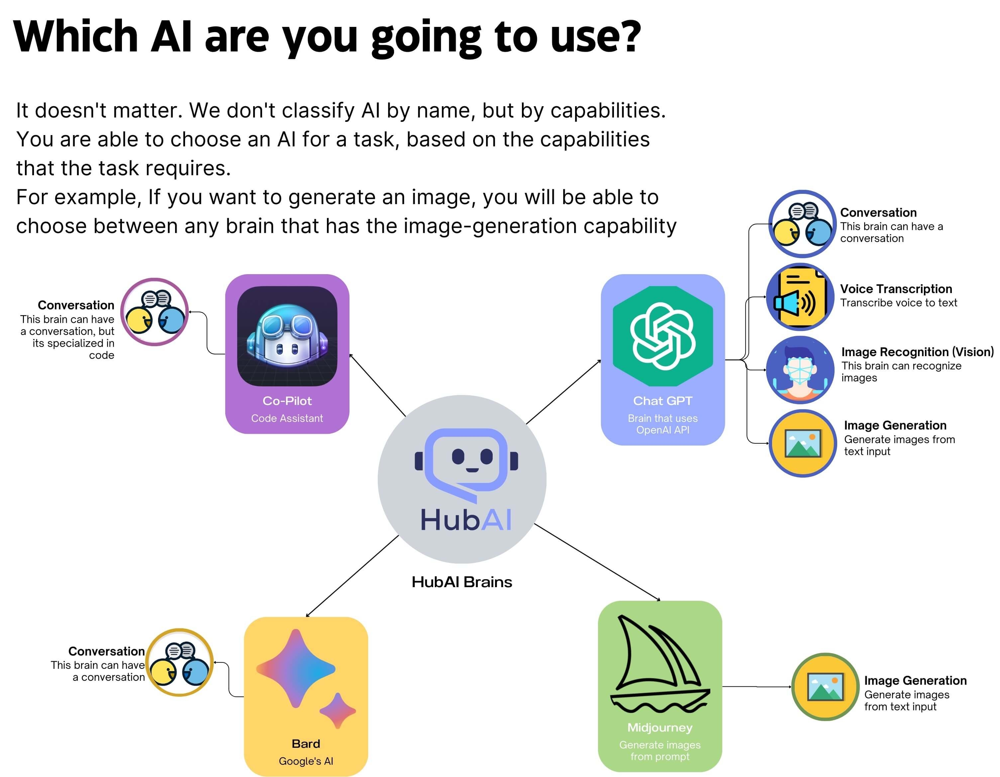

# How HubAI works?

If you're a developer, or just a nerd that loves to know how things work, this section is for you. Here we'll explain how HubAI works under the hood.

## The HubAI Brains (That's how we call AIs!)

At Hubai the user will not install an "AI", they will install a "Brain!". Each brain can have one or more of the following capabilities:

- **Conversation**: Brains with this capability can have conversations with the user through text. The brain is capable of understanding the user input and generate a response (I.e: ChatGPT, Bard, etc.).
- **Voice Transcription**: Brains with this capability can understand voice messages and generate a text transcription from it.
- **Voice Synthesis**: Brains with this capability can generate voice messages from text. 
- **Image Recognition (or vision)**: Brain with this capability can see images and generate content from it. For example, given an image input, the brain can describe the image, or answer any questions about it.
- **Image Generation**: Brains with this capability can generate images from text, just like MidJourney or DALL-E. 

We will implement many other capabilities in the future, so stay in touch!

## How extensions can interact with the AIs?
When an extension is installed, it shouldn't care about which AI is installed on the user machine, it should just care if the user has a brain that has the capabilities that the extension needs to work.
Let's use as example the image-creator extension. Since the main purpose of this extension is to generate image from text, it only needs a brain that has the "Image Generation" capability. It doesn't matter if the user has DALL-E, MidJourney or any other AI installed, the extension should work with any of them. (And the user will choose which one to use)

We don't recommend that you build a tool that only works with a specific AI, because this will limit the number of users that can use your tool, you should instead build a tool that works with any AI that has the capabilities that your tool needs to work.

## How the HubAI Chat works?

The HubAI chat is much more than a simple "AI Chat". In fact, it is as complex as a chat app like WhatsApp or Telegram (ok not that much, but you understand me). Each brain that interacts on a chat it's an actually chat client that is sending and receiving messages from the HubAI Chat server (The server runs locally on your computer, we don't have access to your data). The HubAI server is responsible for sending the messages to the correct brain, and also for sending the messages from the brain to the user. This approach will allow us to implement many cool features in the future, like adding other users to the chat, and not just AIs. 

Our chat input uses the monaco-editor (the same from vs-code) engine to provide a rich text editor that supports syntax highlighting, auto-complete, and many other cool features.

## Nerd stuffs
### How HubAI brains are loaded?
Every HubAI brain is a NodeJS application that runs on the user's computer. When the user installs a brain, HubAI will download the brain files and extract them to the correct folder. After that, HubAI will start to send the prompts to the brain, and the brain will start to send the responses to the user. It's that simple.

### How HubAI extensions are loaded?
Since extensions are built for the front-end, we use a different approach to load it. When the user installs an extension, HubAI will download the extension files and extract them to the app data folder. After that, HubAI will load the extension using webpack's module federation. This approach allows us to load the extension without re-importing all the dependencies that the main app already has, making the extension to load much faster. It also allow us to load an extension without actually downloading it to the user machine.

