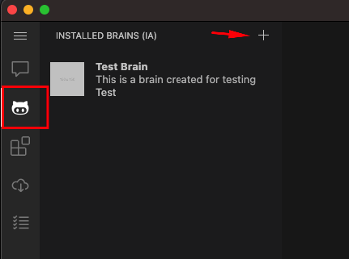
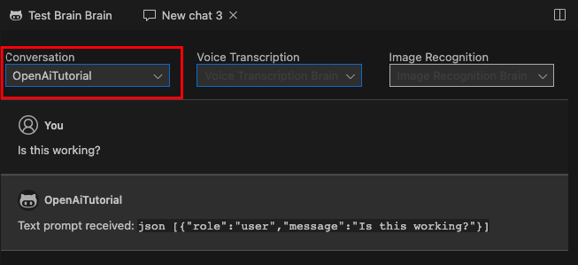
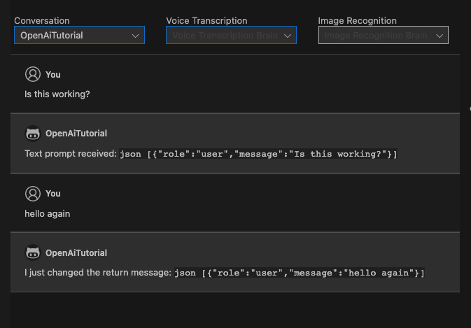
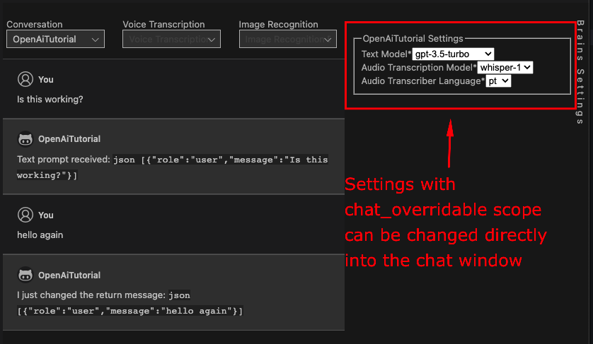
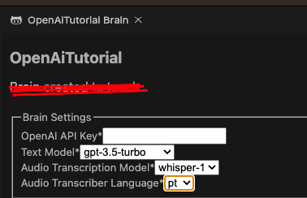
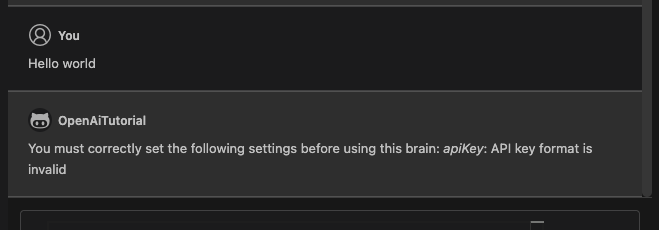
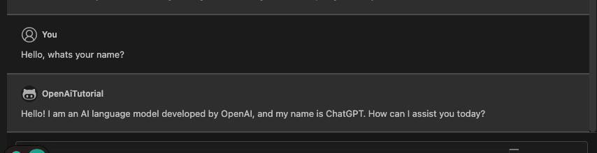
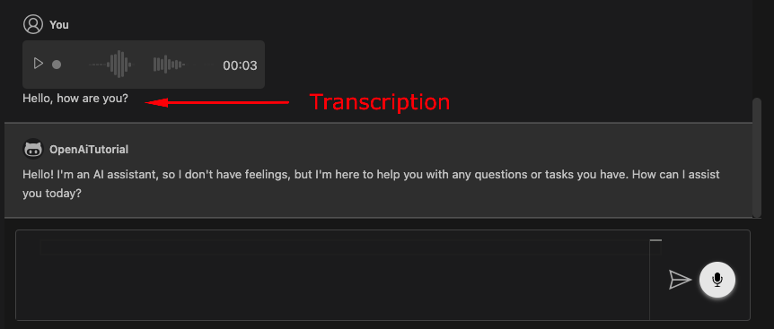

# How to create a brain that uses the OpenAI API

## Introduction

On this tutorial you will learn how to create a brain with conversation and voice transcription capabilities using the OpenAI API.

## Prerequisites

- [Node.js](https://nodejs.org/en/) (version 14 or higher)
- [HubAI CLI](/docs/cli/getting-started.md)
- [A HubAI publisher](/docs/cli/publishers/creating-a-publisher.md)

## Creating the brain

After installing the HubAI CLI, run the following command to create a new brain project:

```shell
hubai brain create
```

Choose the brain-ts template and fill the required information. When asked for the brain capabilities, select "Conversation" and "Voice transcription".
The publisherName should be the name of the publisher that you created on the prerequisites.

A folder with the name of your brain will be created, go to that folder and run the following command:

```shell
npm run package:dev
```

This will generate a .hext file in the root folder of your project. This file is the development package of your brain.

## Installing the development package on HubAI app

Open the HubAI app, go to the "Brains" tab, click on the "+" button and select the .hext file you just generated:



Restart the app and you will be ready to use your brain.

## Testing the brain

:::tip
You can skip this step if you already know how to test a brain
:::
To test the brain, first start the brain server by running the following command on the root folder of your brain project:

```shell
npm start
```

Now go to the HubAI app, start a new chat, select your brain and send a message, you should see the response from the brain:


Now go ahead and edit the `src/brain.ts` file, change the result of the `sendTextPrompt` method to something else and save the file.

```typescript
sendTextPrompt(
    prompts: TextBrainPrompt[],
    context: IBrainPromptContext<ISettings>,
  ): Promise<BrainPromptResponse> {
    const validationResult = this.validateSettings(context.settings);

    return Promise.resolve({
      result: 'I just changed the return message:\n ``json \n' + JSON.stringify(prompts) + '\n``',
      validationResult,
    });
  }
```

Your brain server will automatically apply the changes and you can test it again by sending a new message on the HubAI app


## Installing the OpenAI API package

We will use the [@tectalic/openai](https://www.npmjs.com/package/@tectalic/openai) package to interact with the OpenAI API, so let's install it:

```shell
npm i @tectalic/openai
```

## Creating the brain settings
### Adding the settings to the brain

The OpenAI API requires a few settings to work, like the API Key and the text-model to use, so let's add them to the brain.

Open the `src/brain.ts` file and edit the ISettings interface to add the required settings:

```typescript
export type ISettings = {
  apiKey: string; // Required
  textModel?: string;
  audioTranscriberModel?: string;
  audioTranscriberDefaultLanguage?: string;
};
```

Now we need to add the settings into the package.json file, open it and edit the "brain.settingsMap" array with the settings:

```json
"settingsMap": [
    {
        "displayName": "OpenAI API Key",
        "name": "apiKey",
        "type": "string",
        "required": true
    },
    {
        "displayName": "Text Model",
        "name": "textModel",
        "type": "string",
        "required": true,
        "defaultValue": "gpt-3.5-turbo",
        "enumValues": [
            "gpt-3.5-turbo",
            "text-davinci-003",
            "gpt-4"
        ],
        "scope": "chat_overridable"
    },
    {
        "displayName": "Audio Transcription Model",
        "name": "audioTranscriberModel",
        "type": "string",
        "required": true,
        "defaultValue": "whisper-1",
        "enumValues": [
            "whisper-1",
            "whisper-2"
        ],
        "scope": "chat_overridable"
    },
    {
        "displayName": "Audio Transcriber Language",
        "name": "audioTranscriberDefaultLanguage",
        "type": "string",
        "required": true,
        "defaultValue": "pt",
        "enumValues": [
            "pt",
            "en",
            "es"
        ],
        "scope": "chat_overridable"
    }
]
```

The settings name must match the name of the property on the `ISettings` interface.

The `scope` property defines where the setting can be changed, in this case we want the user to be able to change some of the settings directly on the chat window, so we set it to `chat_overridable`:



:::tip
You can learn more about the settingsMap on the [LocalBrainSettingMap documentation](/docs/api/classes/LocalBrainSettingMap.md).
:::

Everytime that we change the `package.json` file we need to generate a new dev package and install it on the HubAI app again, like we did on the [Installing the development package on HubAI app](#installing-the-development-package-on-hubai-app) section.

```shell
npm run package:dev
```

Now if we go to the brains tab and click on our brain, we should be able to see the settings that we just added:


### Validating the settings

Now that we have the settings, we need to validate them before using them on the brain.

To do that, we will change the `validateSettings` method on the `src/brain.ts` file. This method receives the settings and should return a `BrainSettingsValidationResult` object.

In this example we will check if the API key is valid and has at least 10 characters:

```typescript
validateSettings(settings: ISettings): BrainSettingsValidationResult {
    const validation = new BrainSettingsValidationResult();

    if (!settings?.apiKey || settings.apiKey.length < 10) {
        validation.addFieldError('apiKey', 'API key format is invalid');
    }

    return validation;
}
```

## Using the OpenAI API

Now that we have the settings validated, we can use the OpenAI API to send a text prompt and get the response.

Import the openai package on the `src/brain.ts` file:

```typescript
import openAiSdk from '@tectalic/openai';
```

Change the `sendTextPrompt` method to use the OpenAI API:

```typescript
sendTextPrompt(
    prompts: TextBrainPrompt[],
    context: IBrainPromptContext<ISettings>,
  ): Promise<BrainPromptResponse> {
    // First we validate the settings
    const validationResult = this.validateSettings(context.settings);

    // If the settings are not valid we return the validation result
    if (!validationResult.success) {
        return Promise.resolve({
        result: validationResult.getMessage(),
        validationResult,
        });
    }

    // We create the params to send to the API
    const params = {
        model: context.settings.textModel,
        messages: prompts.map((m) => ({ role: m.role, content: m.message })),
    };

    return openAiSdk(context.settings.apiKey)
        .chatCompletions.create(params)
        .then((response: any) => ({ // Return the OpenAI text response in the result field
            result: response.data.choices[0].message.content.trim(),
            validationResult,
        }));
}
```

Since our brain also has the voice transcription capability, we also need to change the `transcribeAudio` method to use the OpenAI API to transcribe the audio:

```typescript
async transcribeAudio(
    prompt: LocalAudioPrompt,
    context: IBrainPromptContext<ISettings>,
  ): Promise<BrainPromptResponse> {
    // First we validate the settings
    const validationResult = this.validateSettings(context.settings);

    // If the settings are not valid we return the validation result
    if (!validationResult.success) {
      return Promise.resolve({
        result: validationResult.getMessage(),
        validationResult,
      });
    }

    // We create the params to send to the API
    const params = {
      file: prompt.audioFilePath, // The path to the audio file
      language:
        prompt.language ||
        context.settings.audioTranscriberDefaultLanguage ||
        'en', // The language of the audio file
      model: context.settings.audioTranscriberModel, // The model to use for the transcription
    };

    // We send the request to the API
    const result = await openAiSdk(
      context.settings.apiKey,
    ).audioTranscriptions.create(params);

    // We return the result
    return { result: result.data.text, validationResult };
  }
```

## Testing the brain

Lets start the brain server again by running the following command on the root folder of your brain project:

```shell
npm start
```

Now lets try to send a message into the chat window on the HubAI app:


As you can see, the validation failed because we didn't set the API key on the settings.
Go to the brains tab, click on the brain and set the [OpenAI API Key](https://help.openai.com/en/articles/4936850-where-do-i-find-my-secret-api-key) setting.
You can also change the other settings if you want.

Save, and try to send a message again:



You can also send a voice message to the brain and it will automatically transcribe it using the OpenAI API (and the transcription will be used on the text prompt):
(Don't forget to select your brain on the VoiceTranscription setting in the chat window)

Here's the result of a voice message saying "Hello, how are you?":


That's all folks! 

You can check the full code of this brain on the [brains-example](https://github.com/gethubai/brains-examples/tree/main/openai-brain-tutorial) repository.

## Publishing the brain

Now the last step is to publish your brain to the HubAI registry so other users can use it (Don't publish this brain, it's just an example).

See the [Publishing a brain](/docs/brains/publish.md) to learn how to publish your brain.