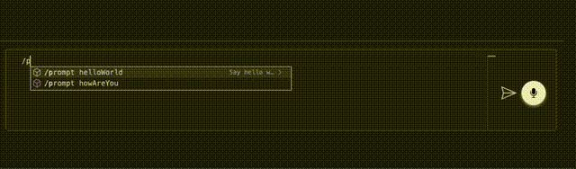

# Creating an extension with chat commands

Make sure you have the [HubAI CLI](/docs/cli/getting-started.md) installed.

This guide will show you how to create an extension that adds new chat commands to the app.

This extension will add the following commands to the chat:

- `/act languageTranslator` - Shows a prompt to make the brain act as a translator.
- `/act developer` - Shows a prompt to make the brain act as a developer.
- `/prompt helloWorld` - Shows a prompt to make the brain say "Hello World!".
- `/prompt howAreYou` - Shows a prompt to make the brain say "How are you?".

## Creating the extension

To create an extension from a template, run:

```shell
hubai extension create
```

Choose the "Empty" template and follow the instructions.

## Adding the chat commands

Let's start by creating a new folder inside the `src` folder called `chatCommands`.
Inside this folder you will create two files: `act.json` and `prompt.json`.

The `act.json` file will contain the completions for the `/act` command:

```json
[
  {
    "label": "languageTranslator",
    "insertText": "I want you to act as an ${1:language} translator, spelling corrector and improver. I will speak to you in any language and you will detect the language, translate it and answer in the corrected and improved version of my text, in ${1:language}. I want you to replace my simplified A0-level words and sentences with more beautiful and elegant, upper level ${1:language} words and sentences. Keep the meaning same, but make them more literary. I want you to only reply the correction, the improvements and nothing else, do not write explanations. My first sentence is \"istanbulu cok seviyom burada olmak cok guzel\"",
    "shortDescription": "Act as a translator",
    "description": "This is the super amazing translator language command. use it with wise"
  },
  {
    "label": "developer",
    "insertText": "I want you to act as an ${1:developerLanguage} developer. You should answer all questions with best practices and as a senior",
    "shortDescription": "Act as a developer",
    "description": "This prompt will make your brain act as a developer."
  }
]
```

The `prompt.json` file will contain the completions for the `/prompt` command:

```json
[
  {
    "label": "helloWorld",
    "insertText": "Say Hello World",
    "shortDescription": "Say hello world",
    "description": "This prompt will make your brain say \"Hello World!\"."
  },
  {
    "label": "howAreYou",
    "insertText": "How are you?"
  }
]
```

:::tip
The `shortDescription` and the `description` properties are optional.
:::

## Adding the commands to the contributes

Now we need to add these commands to the `contributes` array in your package.json.

Open your `package.json` and add the following inside the `extension` section:

```json
{
  "contributes": {
    "chat": {
      "commands": {
        "act": [
          {
            "path": "./src/chatCommands/act.json",
            "language": "en"
          }
        ],
        "prompt": [
          {
            "path": "./src/chatCommands/prompt.json",
            "language": "en"
          }
        ]
      }
    }
  }
}
```

## Packing and installing the extension

Pack the extension by running:

```shell
npm run package
```

This will generate a .hext file inside the root folder of your extension. 
Install the extension into the HubAI app and restart the app.

## Using the commands

Open a new chat window and type `/act` or `/prompt` to see the commands in action.

