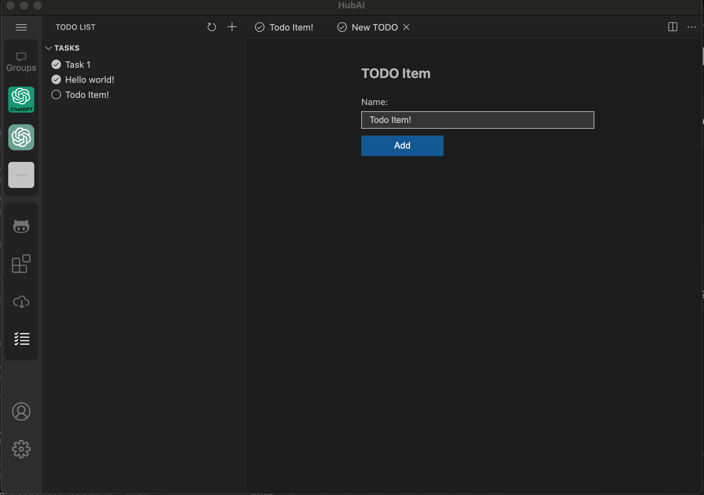

# Workbench

Workbench is the UI-Core of the HubAI app. It provides the basic UI components and services that are used by the app.

## Core Components


We have a few core modules that are used by the HubAI app to provide the basic UI components and services:

- **MenuBar:** Used to add new menu items to the app menu bar.
- **ActivityBar**: Used to add new items to the app activity bar. The activity bar should contain the main navigation items of the app. 
- **SideBar**: Used to add new items to the app sidebar. The sidebar should contain the secondary navigation items of the app. It will be changed when the user clicks on an item in the activity bar, so they are related by id.
- **Editor**: The editor is used to display new windows in the app. It can be used to display a new page, a new dialog, or a new panel.
- **AuxiliaryBar**: It's a bar that can be used to display auxiliary information related to the selected item in the sidebar

## Extending the Workbench
We gonna use the [Todo List](/docs/extensions/templates/todo-list) extension as an example to show how to extend the workbench.



This extension will extend 4 modules: MenuBar, ActivityBar, Sidebar and Editor.

Let's take a look into the extension code:

```typescript
import { AppContext, IExtension, IMenuBarItem, react } from '@hubai/core';
import { TodoListExtensionController } from './controllers';
import TodoListService from './services/todoListService';
import SidebarView from './views/sidebar';

const SidebarId = 'todoList.sidebarPane';

export class TodoListExtension implements IExtension {
  id: string = 'todoList';

  name: string = 'TodoList';

  activate(context: AppContext): void {
    const service = new TodoListService();

    const controller = new TodoListExtensionController(context, service);

    const SidebarViewConnected = connect(service, SidebarView, controller);

    controller.initView();

    const sidebar = {
      id: SidebarId,
      title: 'SidebarPanel',
      render: () => <SidebarViewConnected />,
    };

    const activityBar = {
      id: SidebarId,
      name: 'TodoList',
      title: 'Todo List',
      icon: 'checklist',
    };

    const addTodoItemMenuItem: IMenuBarItem = {
      id: 'todoList.menu.addTodoItem',
      name: 'Add Item',
      icon: 'project',
    };

    // Add the sidebar and activity bar items to the app
    context.services.sidebar.add(sidebar);
    context.services.activityBar.add(activityBar);

    // Add the menu item to the app menu bar (on the File menu)
    context.services.menuBar.append(addTodoItemMenuItem, 'File');
    context.services.menuBar.forceUpdate();
  }

  dispose(context: AppContext): void {
    // Remove the sidebar and activity bar items from the app
    context.services.sidebar.remove(SidebarId);
    context.services.activityBar.remove(SidebarId);
  }
}
```

### Sidebar

The sidebar is used to display the secondary navigation items of the app. It will be changed when the user clicks on an item in the activity bar, so they are related by id.

To add a new sidebar item, we need to create a new object with the following properties, and then call the `add` method from the `sidebar` service:

```typescript
const sidebar = {
  id: SidebarId,
  title: 'SidebarPanel',
  render: () => <SidebarViewConnected />,
};

context.services.sidebar.add(sidebar);
```


### Activity Bar

The activity bar is used to display the main navigation items of the app. It will change the sidebar when the user clicks on an item (**Sidebar and activityBar item should have the same id**!)

To add a new activity bar item, we need to create a new object with the following properties, and then call the `add` method from the `activityBar` service:

```typescript
const activityBar = {
  id: SidebarId,
  name: 'TodoList',
  title: 'Todo List',
  icon: 'checklist',
};

context.services.activityBar.add(activityBar);
```

[Check the list of available icons here](https://microsoft.github.io/vscode-codicons/dist/codicon.html)

### Menu Bar

The menu bar is the main menu of the app. You can add new items to the menu bar by calling the `append` method from the `menuBar` service:

```typescript
const addTodoItemMenuItem: IMenuBarItem = {
  id: 'todoList.menu.addTodoItem',
  name: 'Add Item',
  icon: 'project',
};

context.services.menuBar.append(addTodoItemMenuItem, 'File');
```

The second parameter is the menu where the item will be added.