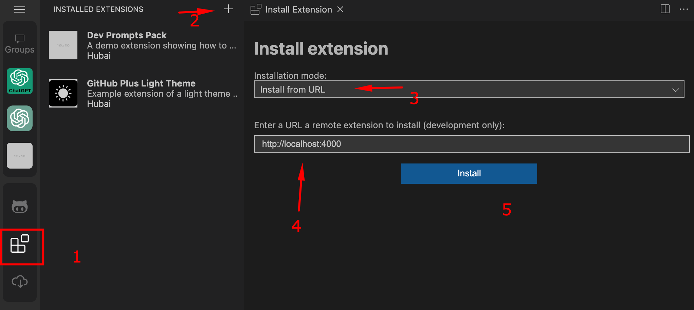

# Getting Started

First, you will need to install the HubAI CLI ([see installation](/docs/cli/getting-started.md)).

## Creating

To create an extension from a template, run:

```shell
hubai extension create
```

Choose the template you want to use and follow the instructions.

## Testing

### Running the development server

Run the following command to start the extension development server:

```shell
npm start
```

### Installing the extension

Go to the HubAI app -> Extensions tab -> click on the "+" button. In the page that opens, select the "Install from URL" option and paste the following URL:

```
http://localhost:4000
```



Click on the "Install" button and restart the app.


:::tip
When you make any changes into your extension, go to the HubAI app and press Ctrl+R to reload the app and apply the latest changes (we're working on a better way to do this).
:::
