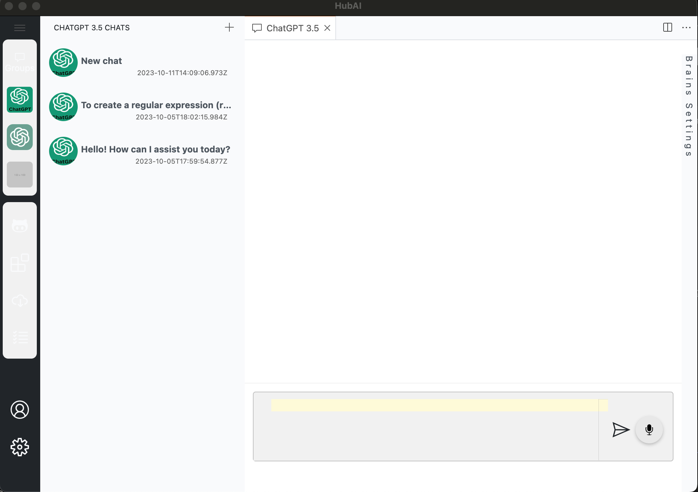

# Github Plus Light Theme

This extension adds a light theme based on the Github Plus theme from vscode. 

The theme colors can be changed at `src/themes/colors.json` file.

An example of how the theme looks like: 
 

(The colors in the image above are just an example, you can change them to whatever you want)